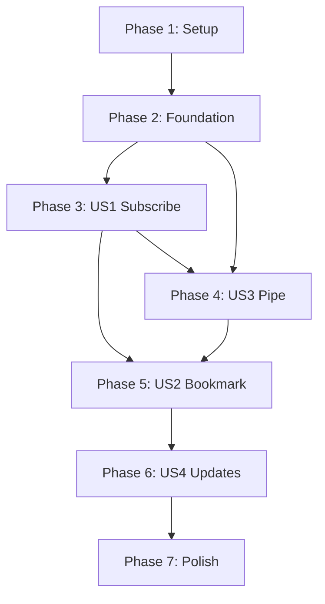

# Implementation Tasks: pkit Phase 1 MVP

**Feature**: pkit Phase 1 MVP - Pure Bookmark Manager
**Branch**: `001-phase1-mvp`
**Created**: 2025-12-26
**Status**: Ready for Implementation

## Overview

This document defines all implementation tasks for pkit Phase 1 MVP, organized by user story for independent delivery. Each phase represents a complete, testable increment.

**User Stories (Priority Order)**:
- **US1** (P1): Subscribe and Discover Prompts - Foundation
- **US3** (P1): Pipe Prompts to Execution Tools - Critical integration
- **US2** (P2): Bookmark and Organize Prompts - Personal workspace
- **US4** (P3): Track Source Updates - Version management

**Recommended MVP**: Deliver US1 + US3 first for core workflow validation.

## Task Summary

- **Total Tasks**: 52
- **Phase 1 (Setup)**: 8 tasks
- **Phase 2 (Foundational)**: 12 tasks
- **Phase 3 (US1 - Subscribe & Discover)**: 10 tasks
- **Phase 4 (US3 - Pipe to Tools)**: 6 tasks
- **Phase 5 (US2 - Bookmark & Organize)**: 9 tasks
- **Phase 6 (US4 - Track Updates)**: 4 tasks
- **Phase 7 (Polish)**: 3 tasks

**Parallel Opportunities**: 28 parallelizable tasks marked with [P]

## Dependencies



**Critical Path**: Setup → Foundation → US1 → US3 → US2 → US4 → Polish

**MVP Delivery**: Setup + Foundation + US1 + US3 = Core workflow

---

## Phase 1: Setup & Project Initialization

**Goal**: Create project structure and initialize development environment

**Duration**: ~2 hours

**Completion Criteria**:
- Repository structure matches plan.md
- Go modules initialized
- Dependencies resolved
- Build succeeds
- Basic README exists

### Tasks

- [X] T001 Initialize Go module in repository root: `go mod init github.com/whisller/pkit`
- [X] T002 [P] Create cmd/pkit/main.go with Cobra root command setup
- [X] T003 [P] Create internal/ package structure: config/, source/, parser/, index/, bookmark/, tui/, display/
- [X] T004 [P] Create pkg/models/ package with placeholder model files
- [X] T005 [P] Add go.mod dependencies: Cobra v1.8.1, Bubbletea v1.2.4, go-git v5.12.0, goccy/go-yaml v1.15.13, zalando/go-keyring v0.2.6, bleve v2.5.7, isatty v0.0.20
- [X] T006 [P] Create Makefile with build, test, lint, clean targets
- [X] T007 [P] Create .github/workflows/test.yml for CI (go test, go fmt, go vet)
- [X] T008 [P] Create README.md with project overview and quick start instructions

---

## Phase 2: Foundational Infrastructure

**Goal**: Build core infrastructure needed by all user stories

**Duration**: ~6 hours

**Completion Criteria**:
- Config management works (load/save ~/.pkit/config.yml)
- Secure token storage works (keyring integration)
- Data models defined and validated
- Rate limit tracking functional
- Git operations wrapper ready
- Basic error handling patterns established

### Tasks

- [X] T009 Define Source model in pkg/models/source.go per data-model.md
- [X] T010 [P] Define Prompt model in pkg/models/prompt.go per data-model.md
- [X] T011 [P] Define Bookmark model in pkg/models/bookmark.go per data-model.md
- [X] T012 [P] Define Config model in pkg/models/config.go per data-model.md
- [X] T013 Implement config loader in internal/config/config.go (load ~/.pkit/config.yml with goccy/go-yaml)
- [X] T014 Implement config saver in internal/config/config.go (atomic write with temp file + rename)
- [X] T015 [P] Implement keyring wrapper in internal/config/keyring.go (zalando/go-keyring with GITHUB_TOKEN fallback)
- [X] T016 [P] Implement rate limit tracker in internal/config/ratelimit.go (track GitHub API calls, warn at 80%)
- [X] T017 [P] Implement git wrapper in internal/source/git.go (go-git clone, pull, status operations)
- [X] T018 [P] Implement GitHub API client in internal/source/github.go (rate limit headers, authentication)
- [X] T019 Implement config validation in internal/config/validate.go (YAML integrity, version check)
- [X] T020 Implement bookmark YAML validation in internal/bookmark/validator.go (FR-024: fail-safe startup check)

---

## Phase 3: User Story 1 - Subscribe and Discover Prompts (P1)

**Goal**: Enable subscribing to GitHub repos and discovering prompts

**Duration**: ~10 hours

**Independent Test Criteria**:
- ✅ User runs `pkit subscribe fabric/patterns` → repo cloned, prompts indexed
- ✅ User runs `pkit search "code review"` → results from all sources shown
- ✅ User runs `pkit show fabric:summarize` → full prompt details displayed
- ✅ Subscribe to invalid repo → clear error message

**Acceptance Scenarios**: spec.md User Story 1 scenarios 1-5

### Tasks

- [X] T021 [US1] Implement Parser interface in internal/parser/parser.go
- [X] T022 [P] [US1] Implement Fabric parser in internal/parser/fabric.go (parse patterns/*/system.md files)
- [X] T023 [P] [US1] Implement awesome-chatgpt-prompts parser in internal/parser/awesome.go (parse prompts.csv)
- [X] T024 [P] [US1] Implement generic markdown parser in internal/parser/markdown.go (parse *.md files)
- [X] T025 [US1] Implement format detection in internal/source/manager.go (auto-detect Fabric vs awesome vs markdown)
- [X] T026 [US1] Implement bleve indexer in internal/index/indexer.go (create index, batch insert, field boosting)
- [X] T027 [US1] Implement bleve search in internal/index/search.go (query, faceting, fuzzy matching)
- [X] T028 [US1] Implement source manager in internal/source/manager.go (subscribe, parallel clone with errgroup)
- [X] T029 [US1] Implement subscribe command in cmd/pkit/subscribe.go (Cobra command with --format, --verbose flags)
- [X] T030 [US1] Implement search command in cmd/pkit/search.go (traditional keyword search, table output)

**Parallel Execution Example**:
```bash
# T022, T023, T024 can run in parallel (different parsers)
# T026, T027 can run in parallel (different index operations)
```

---

## Phase 4: User Story 3 - Pipe Prompts to Execution Tools (P1)

**Goal**: Enable clean piping of prompts to execution tools

**Duration**: ~4 hours

**Independent Test Criteria**:
- ✅ `pkit get review` → ONLY prompt text to stdout, no headers
- ✅ `pkit get review | claude -p "test"` → pipe works correctly
- ✅ `pkit get nonexistent` → error to stderr, exit code 1
- ✅ `pkit get review --json` → valid JSON output
- ✅ `pkit review | claude` → shorthand works (no "get" needed)

**Acceptance Scenarios**: spec.md User Story 3 scenarios 1-5

**CRITICAL**: This is the most important integration point. Must validate with actual tools (claude, llm, fabric, mods).

### Tasks

- [X] T031 [US3] Implement prompt resolver in internal/bookmark/resolver.go (resolve alias or prompt-id to Prompt)
- [X] T032 [US3] Implement text output in internal/display/text.go (ONLY content to stdout, errors to stderr)
- [X] T033 [P] [US3] Implement JSON output in internal/display/json.go (--json flag support)
- [X] T034 [US3] Implement get command in cmd/pkit/get.go (resolve + output, <100ms target)
- [X] T035 [US3] Implement shorthand resolution in cmd/pkit/main.go (Cobra RunE fallback logic)
- [X] T036 [US3] Test piping with real tools: validate `pkit get review | claude`, `| llm`, `| fabric`, `| mods`

**Testing Priority**: T036 is CRITICAL - must manually verify pipe compatibility with all 4 execution tools.

---

## Phase 5: User Story 2 - Bookmark and Organize Prompts (P2)

**Goal**: Enable bookmarking prompts with aliases and tags

**Duration**: ~8 hours

**Independent Test Criteria**:
- ✅ `pkit save fabric:code-review --as review --tags dev` → bookmark saved
- ✅ `pkit bookmarks --tags dev` → filtered bookmarks shown
- ✅ `pkit alias review code-review` → alias renamed
- ✅ `pkit tag review dev,security` → tags updated
- ✅ Save with duplicate alias → warning + overwrite option

**Acceptance Scenarios**: spec.md User Story 2 scenarios 1-5

### Tasks

- [X] T037 [US2] Implement bookmark manager in internal/bookmark/manager.go (CRUD operations on bookmarks.yml)
- [X] T038 [US2] Implement alias validator in internal/bookmark/validator.go (check uniqueness, reserved words, format)
- [X] T039 [US2] Implement tag parser in internal/bookmark/manager.go (parse comma-separated, deduplicate, lowercase)
- [X] T040 [US2] Implement save command in cmd/pkit/save.go (--as, --tags, --notes, --force flags)
- [X] T041 [P] [US2] Implement bookmarks command in cmd/pkit/bookmarks.go (list bookmarks, filter by tags)
- [X] T042 [P] [US2] Implement alias command in cmd/pkit/alias.go (rename bookmark alias)
- [X] T043 [P] [US2] Implement tag command in cmd/pkit/tag.go (update bookmark tags)
- [X] T044 [P] [US2] Implement rm command in cmd/pkit/rm.go (remove bookmark)
- [X] T045 [US2] Update get command to track usage (increment usage_count, update last_used_at in bookmarks.yml)

**Parallel Execution Example**:
```bash
# T041, T042, T043, T044 can run in parallel (independent CLI commands)
```

---

## Phase 6: User Story 4 - Track Source Updates (P3)

**Goal**: Enable checking and upgrading source repositories

**Duration**: ~4 hours

**Independent Test Criteria**:
- ✅ `pkit status` → shows which sources have updates available
- ✅ `pkit upgrade fabric` → source updated, prompts re-indexed
- ✅ `pkit upgrade --all` → all outdated sources updated
- ✅ After upgrade → new prompts appear in search results

**Acceptance Scenarios**: spec.md User Story 4 scenarios 1-5

### Tasks

- [ ] T046 [US4] Implement update checker in internal/source/manager.go (git fetch, compare commit SHAs)
- [ ] T047 [US4] Implement status command in cmd/pkit/status.go (show sources, prompt counts, update availability, rate limits)
- [ ] T048 [US4] Implement upgrade command in cmd/pkit/upgrade.go (git pull + re-index, --all flag for parallel)
- [ ] T049 [US4] Update index/indexer.go to handle re-indexing (clear old prompts from source, re-parse, batch update)

---

## Phase 7: Polish & Cross-Cutting Concerns

**Goal**: Add remaining commands, documentation, and quality improvements

**Duration**: ~4 hours

**Completion Criteria**:
- Interactive find works (Bubbletea TUI)
- Show command displays prompt details
- Help and version commands work
- Documentation complete
- All error messages user-friendly

### Tasks

- [ ] T050 Implement find command in cmd/pkit/find.go (Bubbletea TUI with real-time filtering, Ctrl+S bookmark, Ctrl+T tags, Ctrl+G get)
- [ ] T051 [P] Implement show command in cmd/pkit/show.go (display full prompt with metadata, formatted output)
- [ ] T052 [P] Add help and version commands to cmd/pkit/main.go (Cobra built-in help + custom version)

---

## Implementation Strategy

### MVP-First Approach

**Minimum Viable Product** (Recommended first delivery):
1. Phase 1: Setup ✅
2. Phase 2: Foundation ✅
3. Phase 3: US1 - Subscribe and Discover ✅
4. Phase 4: US3 - Pipe to Tools ✅

**Rationale**: This validates the core hypothesis - multi-source aggregation + tool-agnostic piping. Users can subscribe, search, and use prompts with their preferred execution tools.

**Test MVP with**:
```bash
pkit subscribe fabric/patterns
pkit search "code review"
pkit get fabric:code-review | claude -p "analyse me ~/main.go"
```

### Incremental Delivery After MVP

**Iteration 2** (Add personal workspace):
- Phase 5: US2 - Bookmark and Organize

**Iteration 3** (Add version management):
- Phase 6: US4 - Track Source Updates

**Iteration 4** (Add polish):
- Phase 7: Polish & Interactive TUI

### Parallel Execution Opportunities

**Phase 1 (Setup)** - 6 parallelizable tasks:
- T003, T004, T005, T006, T007, T008 can run in parallel (independent files)

**Phase 2 (Foundation)** - 7 parallelizable tasks:
- T010, T011, T012 can run in parallel (independent models)
- T015, T016, T017, T018 can run in parallel (independent utilities)

**Phase 3 (US1)** - 4 parallelizable tasks:
- T022, T023, T024 can run in parallel (different parsers)
- T026, T027 can run in parallel after parsers complete

**Phase 4 (US3)** - 1 parallelizable task:
- T033 can run in parallel with T032 (different output formats)

**Phase 5 (US2)** - 4 parallelizable tasks:
- T041, T042, T043, T044 can run in parallel (independent commands)

**Phase 7 (Polish)** - 2 parallelizable tasks:
- T051, T052 can run in parallel with T050

## Testing Approach

**Note**: Tests are not explicitly included as tasks since they were not requested in the specification. However, developers should follow Go best practices and write table-driven tests alongside implementation.

**Critical Manual Testing**:
- **T036**: MUST manually verify piping works with claude, llm, fabric, mods
- **Phase 3**: Test subscribe with Fabric and awesome-chatgpt-prompts repos
- **Phase 4**: Test get output is clean (no headers, metadata)
- **Phase 5**: Test bookmark YAML integrity
- **Phase 6**: Test upgrade preserves user data

**Go Testing Best Practices**:
- Write unit tests alongside implementation in `*_test.go` files
- Use table-driven tests for validators and parsers
- Use `testdata/` directory for test fixtures
- Test exported API, not internal implementation
- Run `go test ./...` before committing

## Success Criteria

**Phase 1-2 Complete When**:
- ✅ `go build` succeeds
- ✅ Config loads/saves to ~/.pkit/
- ✅ Keyring integration works
- ✅ Git operations wrapper functional

**Phase 3 Complete When**:
- ✅ `pkit subscribe fabric/patterns` works
- ✅ ~300 prompts indexed in <30 seconds
- ✅ `pkit search "code"` returns results in <1 second
- ✅ Multiple sources work with namespace prefixes

**Phase 4 Complete When**:
- ✅ `pkit get review` outputs ONLY prompt text
- ✅ Piping works with all 4 execution tools
- ✅ Shorthand `pkit review` works
- ✅ Errors go to stderr, not stdout
- ✅ Exit codes correct (0 success, non-zero error)

**Phase 5 Complete When**:
- ✅ Bookmarks persist to YAML
- ✅ Aliases unique and validated
- ✅ Tags filter correctly
- ✅ Usage tracking works

**Phase 6 Complete When**:
- ✅ Status shows update availability
- ✅ Upgrade updates source and re-indexes
- ✅ Parallel upgrade works with --all flag

**Phase 7 Complete When**:
- ✅ Interactive find launches in terminal
- ✅ Find falls back to search when piped
- ✅ Show command displays formatted output
- ✅ Help and version commands work

## Performance Targets

Per spec.md success criteria:

- **SC-001**: Subscribe + index in <30s for ~300 prompts
- **SC-002**: Search results in <1 second
- **SC-003**: Get prompt in <100ms
- **SC-004**: Piping works with claude, llm, fabric, mods
- **SC-005**: Full workflow in <5 minutes first use
- **SC-008**: Binary size <20MB
- **SC-009**: Memory usage <50MB typical

## Validation Checklist

Before marking each phase complete:

- [ ] All tasks in phase completed
- [ ] Independent test criteria met
- [ ] Code follows Go best practices (Principle VIII)
- [ ] Error handling explicit and wrapped
- [ ] No panics except in init
- [ ] go fmt, go vet pass
- [ ] Documentation updated
- [ ] Constitution principles satisfied

## Notes

- **Task IDs**: Sequential T001-T052 in execution order
- **[P] marker**: Parallelizable tasks (different files, no dependencies)
- **[US#] label**: User story tasks only (Setup/Foundation/Polish have no label)
- **File paths**: Explicit in each task description
- **CRITICAL**: T036 must verify pipe compatibility with real execution tools
- **MVP focus**: Complete Phase 1-4 first for core value validation
- **Parallel opportunities**: 28 tasks can run in parallel (54% of tasks)

---

**Generated**: 2025-12-26
**Total Tasks**: 52
**Estimated Duration**: ~38 hours (with parallel execution: ~28 hours)
**Ready for**: `/speckit.implement` command
